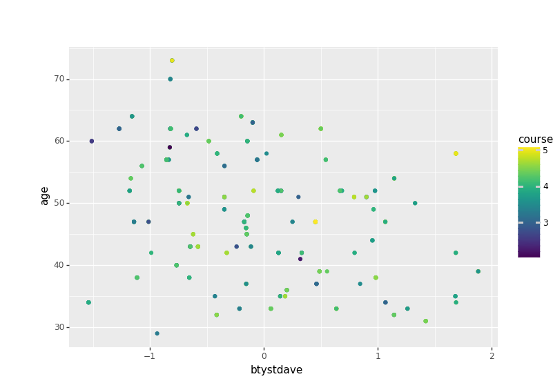

# Lab 4
Przez niepoprawne działanie i brak czasu na naprawę jupytera wyniki prezentuję w readme
## Excercise.csv - część pierwsza
```python
import statsmodels.formula.api as smf

import pandas as pd
import plotnine as p9

data = pd.read_csv("../Analysis Data/excercise1.csv")
shortData = data.head(40)
```
```
  y    x1     x2
0   15.68  6.87  14.09
1    6.18  4.40   4.35
2   18.10  0.43  18.09
3    9.07  2.73   8.65
4   17.97  3.25  17.68
5   10.04  5.30   8.53
6   20.74  7.08  19.50
7    9.76  9.73   0.72
8    8.23  4.51   6.88
9    6.52  6.40   1.26
10  15.69  5.72  14.62
11  15.51  6.28  14.18
12  20.61  6.14  19.68
13  19.58  8.26  17.75
14   9.72  9.41   2.44
15  16.36  2.88  16.10
16  18.30  5.74  17.37
17  13.26  0.45  13.25
18  12.10  3.74  11.51
19  18.15  5.03  17.44
20  16.80  9.67  13.74
21  16.55  3.62  16.15
22  18.79  2.54  18.62
23  15.68  9.15  12.74
24   4.08  0.69   4.02
25  15.45  7.97  13.24
26  13.44  2.49  13.21
27  20.86  9.81  18.41
28  16.05  7.56  14.16
29   6.00  0.98   5.92
30   3.29  0.65   3.22
31   9.41  9.00   2.74
32  10.76  7.83   7.39
33   5.98  0.26   5.97
34  19.23  3.64  18.89
35  15.67  9.28  12.63
36   7.04  5.66   4.18
37  21.63  9.71  19.32
38  17.84  9.36  15.19
39   7.49  0.88   7.43
40    NaN  9.87  10.43
41    NaN  9.99  15.72
42    NaN  8.39   0.35
43    NaN  0.80  10.91
44    NaN  9.58  15.82
45    NaN  4.82  11.90
46    NaN  2.97   2.46
47    NaN  8.80   4.09
48    NaN  6.07   1.80
49    NaN  0.19  13.54
50    NaN  4.19  19.13
51    NaN  5.39  14.84
52    NaN  6.58   5.28
53    NaN  2.36  15.42
54    NaN  2.37   4.12
55    NaN  1.52   6.54
56    NaN  2.07   2.67
57    NaN  6.70  12.85
58    NaN  2.02   8.36
59    NaN  9.63  12.16
```
```python
 results = smf.ols('y~x2+x1', data=shortData).fit()
wyn = results.params
print(results.summary())
```
```
                         OLS Regression Results                            
==============================================================================
Dep. Variable:                      y   R-squared:                       0.972
Model:                            OLS   Adj. R-squared:                  0.971
Method:                 Least Squares   F-statistic:                     652.4
Date:                Thu, 12 Dec 2019   Prob (F-statistic):           1.41e-29
Time:                        17:49:24   Log-Likelihood:                -50.985
No. Observations:                  40   AIC:                             108.0
Df Residuals:                      37   BIC:                             113.0
Df Model:                           2                                         
Covariance Type:            nonrobust                                         
==============================================================================
                 coef    std err          t      P>|t|      [0.025      0.975]
------------------------------------------------------------------------------
Intercept      1.3151      0.388      3.392      0.002       0.530       2.101
x2             0.8069      0.024     33.148      0.000       0.758       0.856
x1             0.5148      0.046     11.216      0.000       0.422       0.608
==============================================================================
Omnibus:                       14.478   Durbin-Watson:                   2.509
Prob(Omnibus):                  0.001   Jarque-Bera (JB):               15.393
Skew:                           1.341   Prob(JB):                     0.000454
Kurtosis:                       4.428   Cond. No.                         38.7
==============================================================================

```
```python
fig3 = (p9.ggplot(p9.aes(x='x1', y='x2', color='y'), data=shortData)
        + p9.geom_point())

print(fig3)
```

```python
#przewidywanie na podstawie modelu y
shortData['y_predict'] = results.predict()

fig3_res = (p9.ggplot(p9.aes(x='x1', y='x2', color='y_predict'), data=shortData)
            + p9.geom_point())
print(fig3_res)
```

```python
#wyznacznenie błędu przewidywań
shortData['residuals'] = shortData['y'] - shortData['y_predict']

fig3_res = (p9.ggplot(p9.aes(x='x1', y='x2', color='residuals'), data=shortData)
            + p9.geom_point())
print(fig3_res)
```

```python
#przewidywanie dla nowych danych bez y wzorcowego
pred = data.tail(20)
pred['y'] = results.predict(pred)
fig4 = (p9.ggplot(p9.aes(x='x1', y='x2', color='y'), data=pred)
            + p9.geom_point())
print(fig4)
```

##beauty.csv - część druga
```python
import numpy as np

import statsmodels.api as sm

import statsmodels.formula.api as smf

import pandas as pd
import plotnine as p9

data = pd.read_csv("beauty.csv")
print(data)
```
```
tenured  profnumber  minority  ...  btystdvariance  btystdavepos  btystdaveneg
0          0           1         1  ...        2.129806      0.201567      0.000000
1          1           2         0  ...        1.386081      0.000000     -0.826081
2          1           3         0  ...        2.537435      0.000000     -0.660333
3          1           4         0  ...        1.760577      0.000000     -0.766312
4          0           5         0  ...        1.693100      1.421450      0.000000
..       ...         ...       ...  ...             ...           ...           ...
458        0          93         0  ...        3.107088      1.143040      0.000000
459        0          93         0  ...        3.107088      1.143040      0.000000
460        0          94         1  ...        3.018447      0.332051      0.000000
461        0          94         1  ...        3.018447      0.332051      0.000000
462        0          94         1  ...        3.018447      0.332051      0.000000

[463 rows x 64 columns]
```
```python
tworzenie złożonego modelu
results = smf.ols('courseevaluation~btystdave+age+beautyflowerdiv+beautyfupperdiv+beautymlowerdiv', data=data).fit()
wyn = results.params
print(results.summary())
```
```
                            OLS Regression Results                            
==============================================================================
Dep. Variable:       courseevaluation   R-squared:                       0.056
Model:                            OLS   Adj. R-squared:                  0.046
Method:                 Least Squares   F-statistic:                     5.450
Date:                Thu, 12 Dec 2019   Prob (F-statistic):           6.96e-05
Time:                        18:36:40   Log-Likelihood:                -370.34
No. Observations:                 463   AIC:                             752.7
Df Residuals:                     457   BIC:                             777.5
Df Model:                           5                                         
Covariance Type:            nonrobust                                         
===================================================================================
                      coef    std err          t      P>|t|      [0.025      0.975]
-----------------------------------------------------------------------------------
Intercept           4.1944      0.304     13.805      0.000       3.597       4.791
btystdave           0.2675      0.115      2.326      0.020       0.041       0.494
age                 0.0015      0.003      0.509      0.611      -0.004       0.007
beautyflowerdiv    -0.0326      0.028     -1.173      0.241      -0.087       0.022
beautyfupperdiv     0.0225      0.027      0.830      0.407      -0.031       0.076
beautymlowerdiv    -0.0668      0.027     -2.514      0.012      -0.119      -0.015
==============================================================================
Omnibus:                       21.453   Durbin-Watson:                   1.450
Prob(Omnibus):                  0.000   Jarque-Bera (JB):               23.677
Skew:                          -0.553   Prob(JB):                     7.22e-06
Kurtosis:                       2.928   Cond. No.                         632.
==============================================================================
```
```python
fig3 = (p9.ggplot(p9.aes(x='btystdave',y='age', color='courseevaluation'), data=data)
        + p9.geom_point())

print(fig3)
```

```python
data['courseevaluation_predict'] = results.predict()

#wyres błędu
data['residuals'] = data['courseevaluation'] - data['courseevaluation_predict']

fig3_res = (p9.ggplot(p9.aes(x='btystdave',y='age', color='residuals'), data=data)
            + p9.geom_point())
print(fig3_res)
```

